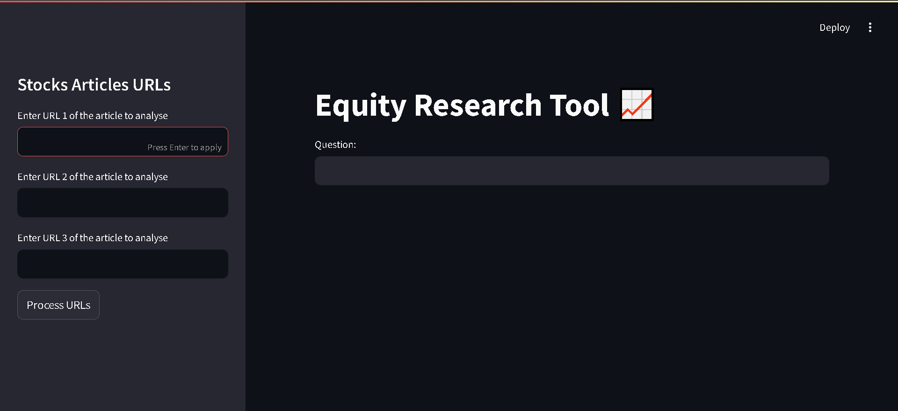
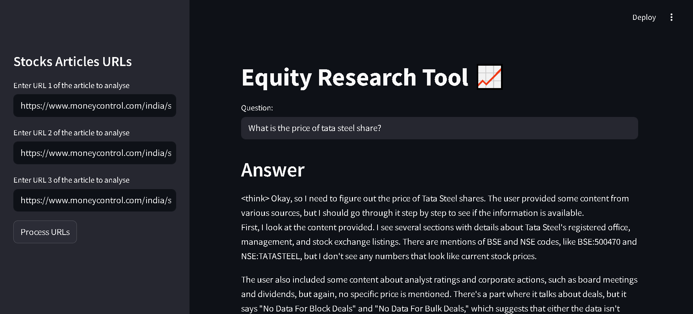

# Equity Research Tool 📈

A powerful AI-powered tool for analyzing financial articles and extracting insights through natural language queries.



## Table of Contents
- [Overview](#overview)
- [Features](#features)
- [Installation](#installation)
- [Usage](#usage)
- [Screenshots](#screenshots)
- [Technical Implementation](#technical-implementation)
- [Future Enhancements](#future-enhancements)
- [License](#license)

## Overview

The Equity Research Tool allows users to analyze multiple financial articles simultaneously without reading them in full. Simply provide the URLs of articles you want to analyze, and ask questions in natural language to extract specific insights.

## Features

- **Multi-URL Analysis**: Process up to 3 financial articles simultaneously
- **AI-Powered Q&A**: Ask natural language questions about the content
- **Source Attribution**: Responses include citations to original sources
- **Semantic Search**: Advanced embeddings for finding relevant information
- **User-Friendly Interface**: Simple, intuitive Streamlit UI

## Installation

1. Clone this repository:
   ```bash
   git clone https://github.com/yourusername/equity-research-tool.git
   cd equity-research-tool
   ```

2. Create a virtual environment:
   ```bash
   conda create -n equity-research python=3.10
   conda activate equity-research
   ```
   
   Or with venv:
   ```bash
   python -m venv venv
   # On Windows
   venv\Scripts\activate
   # On macOS/Linux
   source venv/bin/activate
   ```

3. Install the required packages:
   ```bash
   pip install -r requirements.txt
   ```

4. Create a `.env` file in the project root with your API key:
   ```
   GROQ_API_KEY=your_groq_api_key_here
   ```

## Usage

1. Start the Streamlit application:
   ```bash
   streamlit run main.py
   ```

2. Enter the URLs of financial articles you want to analyze in the sidebar
   
3. Click "Process URLs" to extract and process the content

4. Ask questions in the main text input field and get AI-generated answers with source citations

## Screenshots

### Home Screen

*The main interface where users can input article URLs and ask questions*

### Processing URLs

*The application shows progress when processing article content*

### Asking Questions

*Example of query results with answer and source attribution*

## Technical Implementation

The application uses:
- **Groq API**: For LLM inference using deepseek-r1-distill-llama-70b
- **LangChain**: For document processing and Q&A implementation
- **HuggingFace Embeddings**: Sentence transformers for semantic search
- **FAISS**: For efficient vector storage and retrieval
- **Streamlit**: For the interactive web interface

## Future Enhancements

- Support for PDF document analysis
- Historical data storage and comparison
- Chart and graph generation for financial metrics
- Expanded sources and real-time updates
- Custom user profiles for personalized analysis

## License

[MIT License](LICENSE)
